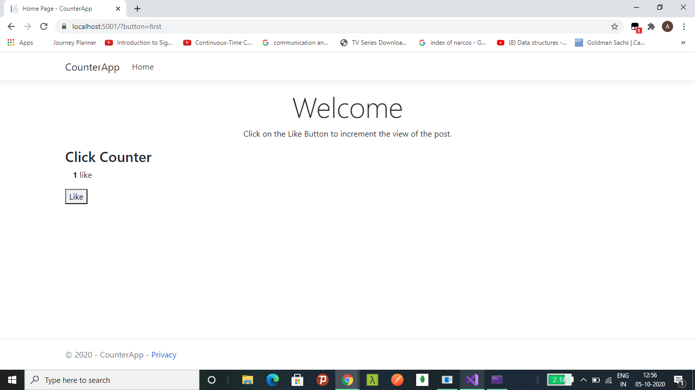

# CounterApp
This is developed in .NET MVC Framework with C# as backend language.
When a user clicks on the like button , it's count increases and it is visible to the user. 

1) The first screenshot when no user click on the like button

2) As user clicks on the like button, it's count increases by 1 . 
  
  
 3) User clicked 5 times on the like button , it's count increases by 5 . 
   
   
  Bonus : 
    1) Adding realtime updates to our likes counter with Pusher.
            While a user clicks a like button we’d like them to know when more people like the button by increasing the number of likes without requiring a refresh. 
            We can achieve this by using Pusher.
            Install Pusher via NuGet - *a packer manager for ASP.NET *  
    2)We can use Blazor in .NET for client side rendering to increment the counter and save it in a table/database. 
    
    
